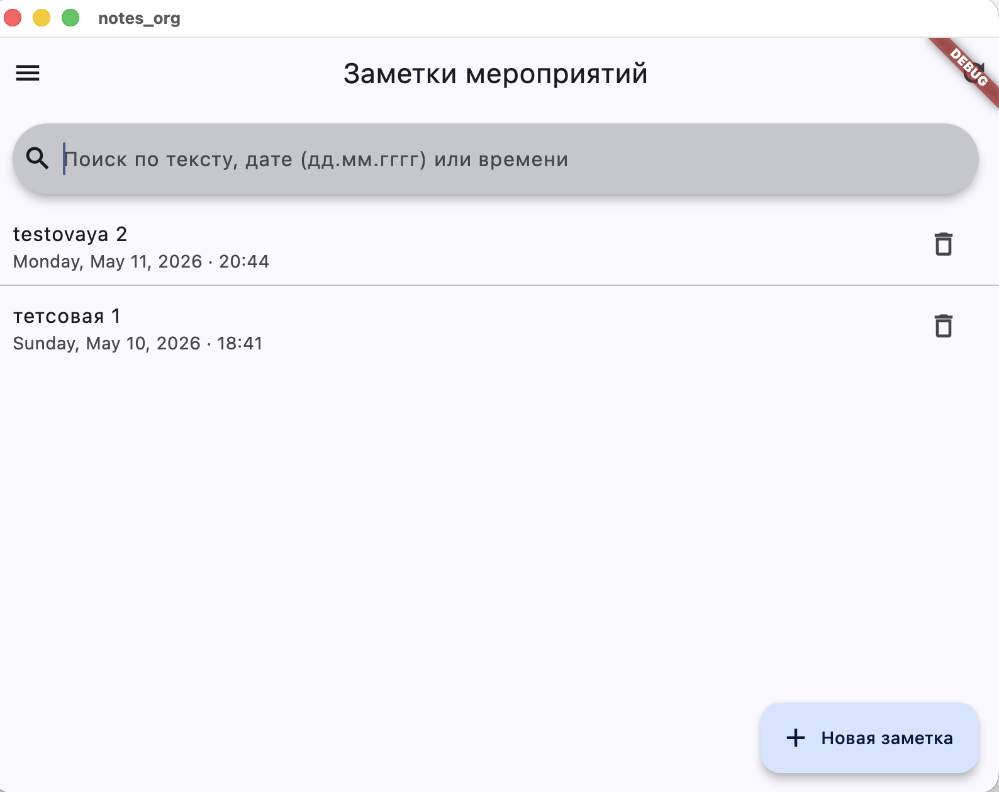
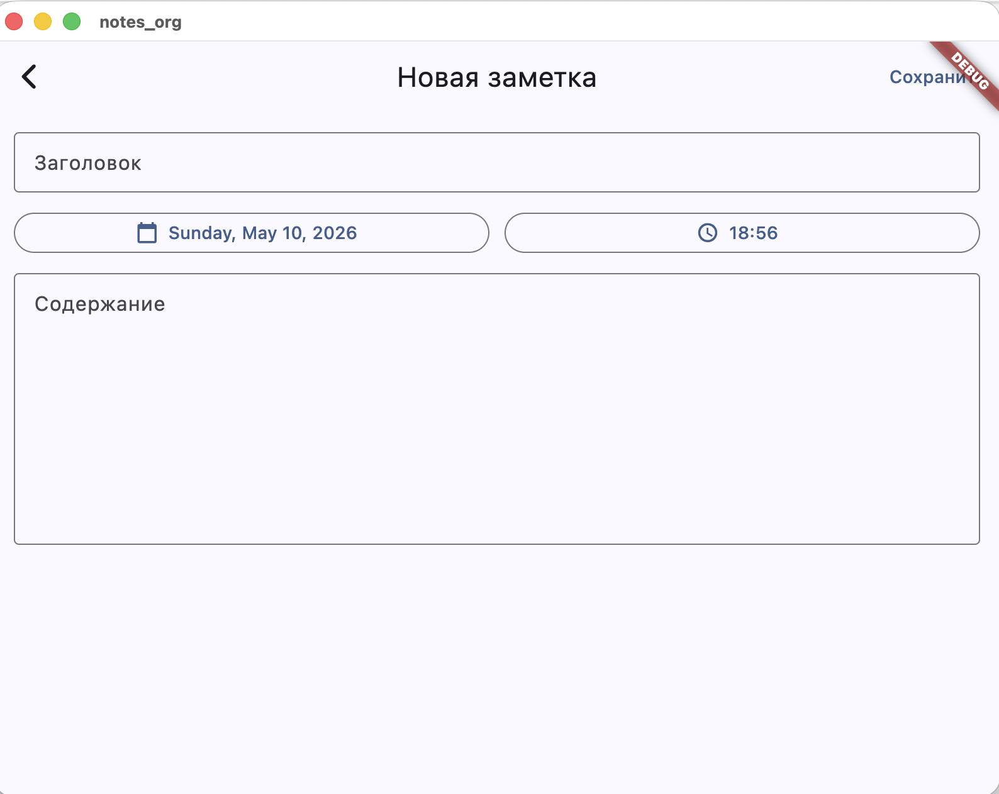
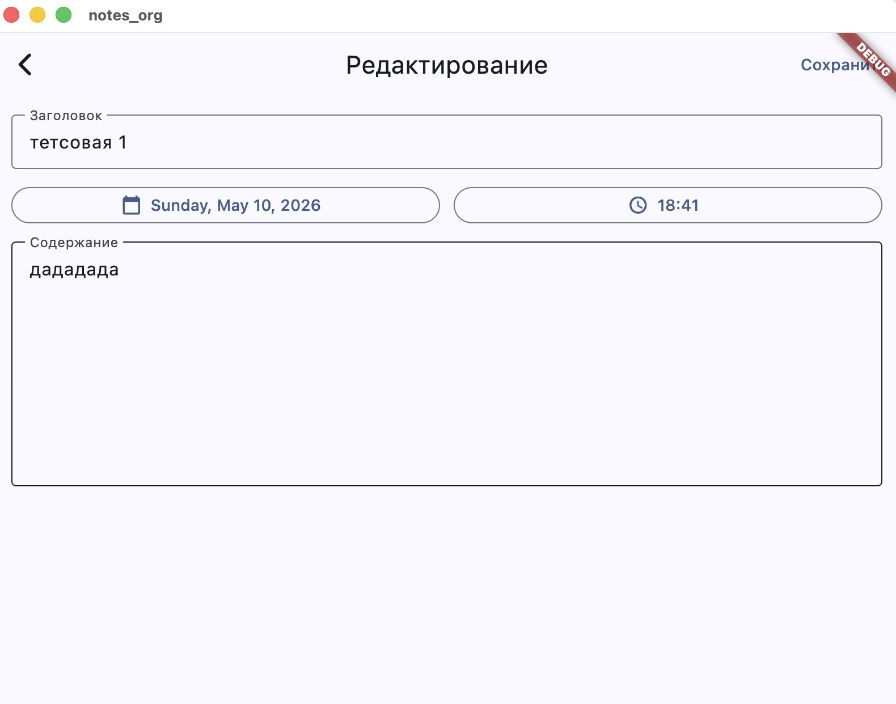
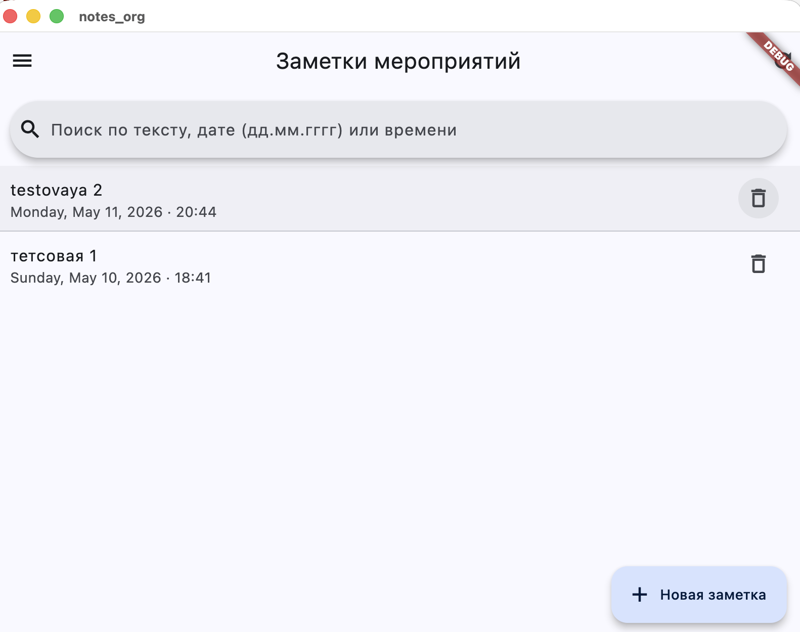
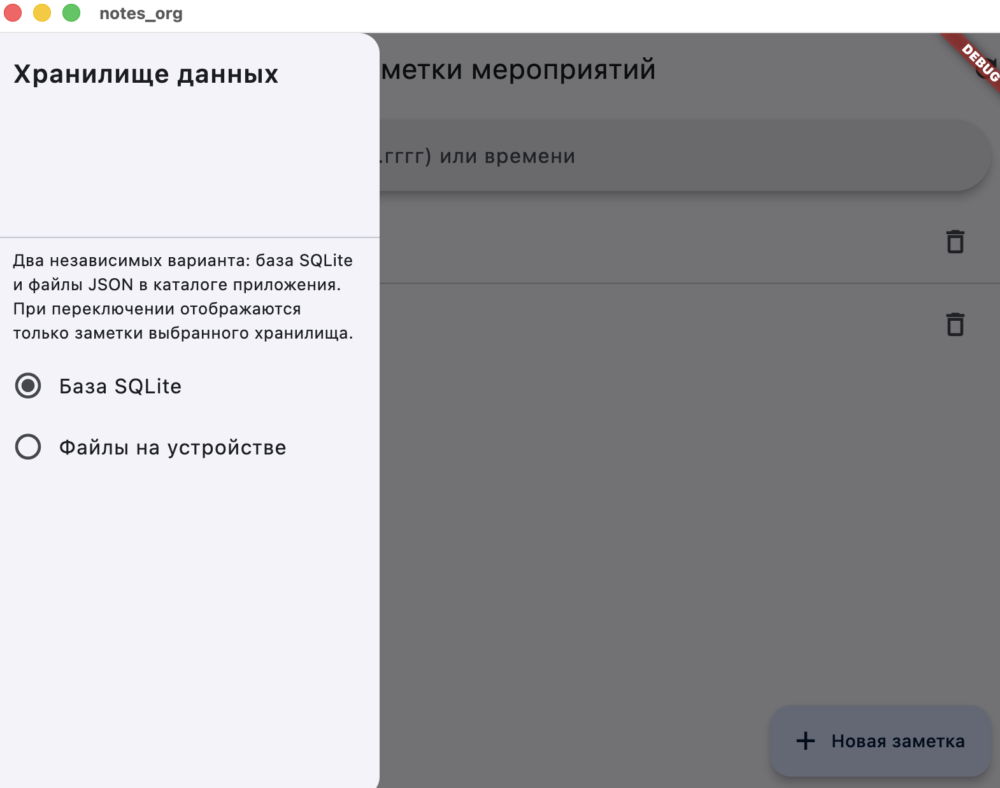

# Кейс №4 — мобильное приложение «Заметки мероприятий»

Проект: **Flutter** (`notes_org`) — **iOS** и **Android**; ту же сборку можно **запускать на macOS как десктоп-приложение** (удобная проверка с Mac без эмулятора).

### Запуск на Mac без телефона

В каталоге проекта:

```bash
cd "/Users/dbte5/Desktop/praktika/test case 4"
flutter pub get
flutter run -d macos
```

Первый раз Xcode может запросить установку компонентов. Список устройств: `flutter devices` — в нём должна быть строка **macOS (desktop)**.

---

## 1. Назначение и функциональные возможности

Приложение предназначено для ведения кратких записей в контексте работы организации: совещания, собрания, конференции, деловые встречи. Для каждой заметки задаются:

| Поле | Описание |
|------|----------|
| **Заголовок** | Краткое название записи |
| **Дата** | Дата связанного мероприятия |
| **Время** | Время события |
| **Содержание** | Полный текст заметки |

Реализовано:

1. **Создание** — кнопка «Новая заметка» открывает форму ввода.
2. **Редактирование** — нажатие по строке в списке открывает ту же форму с заполненными полями.
3. **Удаление** — иконка корзины в строке заметки, с подтверждением в диалоге.
4. **Поиск** — строка поиска на главном экране: фильтрация по **ключевым словам** в заголовке и тексте, а также по **текстовому представлению даты** (`дд.мм.гггг`) и **времени** (`чч:мм`), введённым в поле запроса.

### Два режима хранения данных

В боковом меню («гамбургер» слева вверху) можно выбрать режим (**данные между режимами не объединяются**):

| Режим | Как это устроено |
|--------|------------------|
| **База SQLite** | Локальная БД `notes_org.db` в каталоге документов приложения. |
| **Файлы на устройстве** | Каждая заметка — отдельный JSON-файл в подкаталоге `notes_org_files`. |

Дополнительно: **синхронизация с облаком** в этой минимальной версии **не реализована**; её можно рассматривать как перспективу (Firebase, собственный API, iCloud и т.д.).

---

## 2. Руководство пользователя (с местами для иллюстраций)

Ниже — последовательность действий. **Вставьте скриншоты** вместо плейсхолдеров после запуска приложения на эмуляторе или устройстве.

### 2.1. Главный экран

- Отображается список заметок, отсортированный по **дате/времени мероприятия** (новые сверху в рамках отображаемого порядка).
- Вверху — **поиск**: введите слово из заголовка или текста, либо фрагмент даты/времени (например, `10.05.2026` или `14:30`).
- Кнопка **обновить** в панели действий перечитывает список из текущего хранилища.

**Место для скриншота:**



*Подпись для отчёта: главный экран со списком заметок и полем поиска.*

### 2.2. Создание заметки

1. Нажмите **«Новая заметка»** (плавающая кнопка внизу).
2. Заполните заголовок и содержание.
3. Нажмите **«Дата мероприятия»** и выберите дату в календаре.
4. Нажмите **«Время»** и выберите время.
5. Нажмите **«Сохранить»** вверху справа.

**Место для скриншота:**



### 2.3. Редактирование

- В списке нажмите на нужную строку — откроется форма с теми же полями. Измените данные и нажмите **«Сохранить»**.



### 2.4. Удаление

- В строке заметки нажмите иконку **корзины**. Подтвердите удаление в диалоге.



### 2.5. Выбор хранилища (SQLite / файлы)

1. Откройте **боковое меню** (три полоски / иконка меню слева вверху).
2. Выберите **«База SQLite»** или **«Файлы на устройстве»**.



*Пояснение для пользователя:* при смене режима отображаются только те заметки, которые сохранены в этом режиме.

---

## 3. Ссылка на приложение и способ предоставления

### Вариант A — локальная проверка из исходников (удобно для практики)

**Репозиторий / папка проекта:**

```text
/Users/dbte5/Desktop/praktika/test case 4
```

Это каталог Flutter-проекта `notes_org`. Для проверки достаточно открыть его в редакторе или передать архив этой папки.

### Вариант B — установочный файл (Android)

В каталоге проекта выполните сборку APK (требуются Android SDK и настройка окружения):

```bash
cd "/Users/dbte5/Desktop/praktika/test case 4"
flutter build apk --debug
```

Готовый файл по умолчанию:

```text
build/app/outputs/flutter-apk/app-debug.apk
```

Его можно перенести на устройство с Android и установить (разрешите установку из неизвестных источников при необходимости).

### Вариант C — публикация

При необходимости проект можно выложить в **закрытый или открытый репозиторий Git** (GitHub, GitLab, Gitea) и в отчёте указать **HTTPS-ссылку на репозиторий** и тег/коммит версии.

---

## 4. Пояснение для научного руководителя: как протестировать

1. **Установка инструментов:** [Flutter SDK](https://docs.flutter.dev/get-started/install), для Android — Android Studio / SDK; для iOS на macOS — Xcode.
2. **Проверка окружения:** в каталоге проекта выполнить `flutter doctor` и убедиться, что выбранные платформы отмечены как готовые.
3. **Запуск:** на **Mac** без телефона — `flutter run -d macos` (см. раздел выше). Иначе подключить телефон по USB **или** запустить эмулятор Android/iOS и выполнить:
     ```bash
     cd "<путь к проекту>"
     flutter pub get
     flutter run
     ```
4. **Сценарий проверки (чеклист):**
   - создать заметку с датой и временем, сохранить, убедиться, что она в списке;
   - открыть заметку, изменить текст, сохранить;
   - выполнить поиск по ключевому слову из заголовка и по части даты;
   - удалить заметку с подтверждением;
   - в меню выбрать **«Файлы на устройстве»**, создать заметку, убедиться, что в режиме **SQLite** она не видна (независимые хранилища); переключить обратно и проверить, что данные в SQLite на месте;
   - повторить краткий сценарий в режиме файлов.

5. **Автоматическая проверка (опционально):** `flutter test` — базовый smoke-тест сборки приложения.

---

## 5. Структура исходного кода (кратко)

| Путь | Назначение |
|------|------------|
| `lib/main.dart` | Точка входа, тема приложения |
| `lib/screens/home_screen.dart` | Список, поиск, меню хранилища |
| `lib/screens/note_edit_screen.dart` | Создание и редактирование |
| `lib/models/note.dart` | Модель заметки, JSON для файлов |
| `lib/storage/sqlite_note_storage.dart` | SQLite |
| `lib/storage/file_note_storage.dart` | Файловое хранение |
| `lib/search/note_search.dart` | Логика поискового фильтра |

---

*Документ соответствует минимальной рабочей версии приложения под кейс-задачу №4. Для оформления отчёта добавьте реальные скриншоты в каталог `docs/screenshots/` (каталог можно создать вручную) и замените пути в ![...] при необходимости.*

---

## Кейс № 5 — юзабилити-тестирование и презентация

| Документ | Назначение |
|----------|------------|
| [docs/case5/KEIS_5_OTCHET_YUZABILITI.md](docs/case5/KEIS_5_OTCHET_YUZABILITI.md) | Полный отчёт: цели, участники, сценарий, проведение, анализ, рекомендации |
| [docs/case5/PREZENTACIYA_KEIS_5_MARP.md](docs/case5/PREZENTACIYA_KEIS_5_MARP.md) | Слайды (Marp → экспорт PDF / PPTX для преподавателя) |

Перед сдачей: экспортируйте Marp в файл, загрузите в облако и **пропишите ссылку** в `SSYLKA_NA_PREZENTACIYU.md` и в титульном документе практики.
